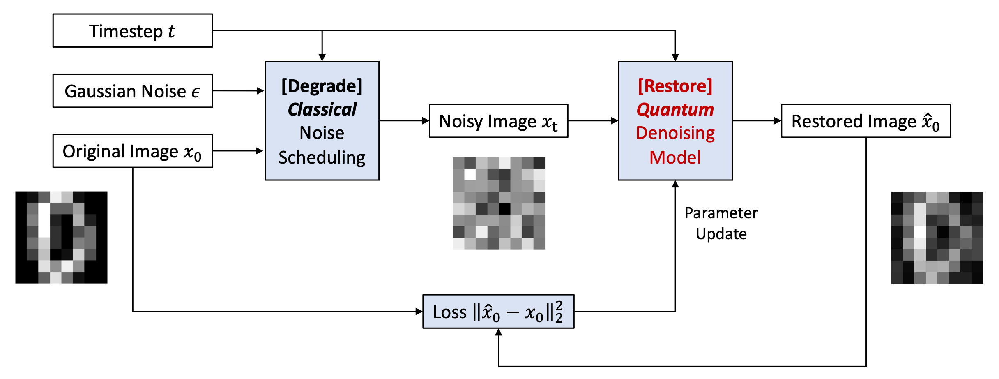
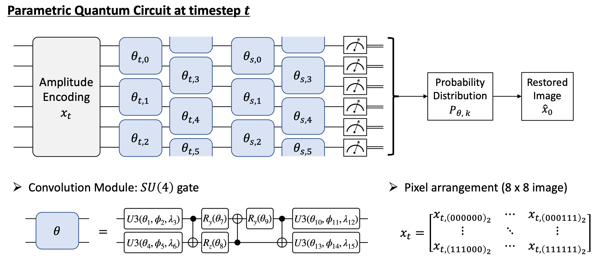
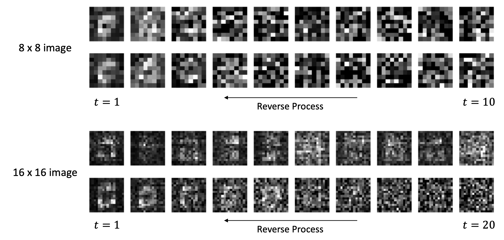

# Quantum Diffusion Models for Image Generation

Code implementation for the presentation "Quantum Denoising Diffusion Probabilistic Models for Image Generation" at Korean Conference on Semiconductors (KCS), Feb 15, 2023.

It provides a proof-of-concept of quantum diffusion models for image generation task.

### Quantum Denoising Diffusion Model

### Quantum circuit for restore operation

### Sampling digit images from gaussian noise

